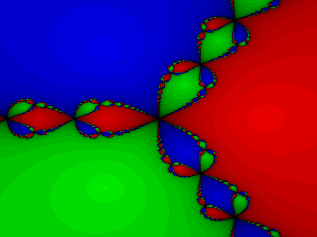

# Newton's Method Fractal Generation

Code to draw the Newton's method fractal for the solutions to z³ - 1 = 0. I've
written solutions several times in different languages/environments. It's meaty
enough to require some actual work but still tractable, particularly if you
don't need to roll your own complex point structs/arithmetic.

Here, it offered a chance to learn go, its tools, and how golang packages are
typically structured.

## Running the code and generating images

The code is implemented as a library that returns an image.RGBA but since
I actually wanted to see the output and run some profiling code there is
a main package file in cmd/newton.

```
$ cd cmd/newton
$ go run main.go
```

Will output a copy of timing related numbers to the console and will create
an output PNG file (and profiling data if that code is not commented out).
There is a 128 bit version as well but there's no detectable difference in
the output with the given bounds. The 128-bit version runs slightly faster
because the golang complex number arithmetic functions only operates on 128
bit numbers and so the 64 bit version does a lot of casting.

## Musings

It runs surprisingly slowly and I think it got a lot slower with a recent
golang update. About 1300ms on my MacBookAir. The most recent of my prior
implementations of this code was in JavaScript and it computed the same size
image in under 200ms on the same hardware.

The slowness on the older golang version
seemed to be memory allocation related. The new slowness seems split between
memory allocation and the actual math.

```
(pprof) top10
950ms of 1250ms total (76.00%)
Showing top 10 nodes out of 60 (cum >= 50ms)
      flat  flat%   sum%        cum   cum%
     270ms 21.60% 21.60%      270ms 21.60%  runtime.(*mcentral).grow
     150ms 12.00% 33.60%      150ms 12.00%  math.Sincos
     120ms  9.60% 43.20%      120ms  9.60%  math.Hypot
     100ms  8.00% 51.20%      250ms 20.00%  math.Pow
      70ms  5.60% 56.80%      190ms 15.20%  math.atan2
      60ms  4.80% 61.60%       60ms  4.80%  math.xatan
      50ms  4.00% 65.60%       50ms  4.00%  math.modf
      50ms  4.00% 69.60%      110ms  8.80%  math.satan
      40ms  3.20% 72.80%      770ms 61.60%  github.com/ghurley/newton.newton64
      40ms  3.20% 76.00%       50ms  4.00%  math.frexp
```

I'm surprised to see all the trig functions (and satan!) which I don't invoke
directly so they may all come from the `cmplx.Abs()`. Even if I managed to get
rid of all of that slowness, the `runtime.(\*mcentral).grow` would still make
this implementation slower than the JS version.

### [UPDATE]
Well, I found a way to cut the runtime by more than half. In short, don't use cmplx.Pow();
do the multiplication [manually](https://github.com/ghurley/newton/commit/7bfc9069c95d5961d3144961c7c35f8ab45a9783).
